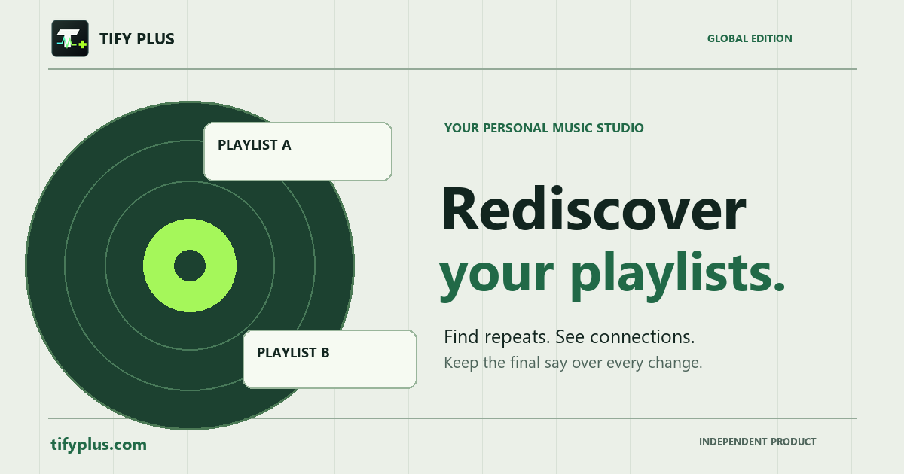

# Tify Plus

[Türkçe tanıtım](README.md) · [Global site](https://tifyplus.com/?lang=en) · [Turkish site](https://tifyplus.com/?lang=tr)

> Rediscover your playlists. Find repeated tracks, see how your playlists connect, and manage your music library on your own terms.

**Live app:** [tifyplus.com/?lang=en](https://tifyplus.com/?lang=en)



## What it does

Tify Plus is an independent, open-source workspace for your Spotify library. Connect your Spotify account to inspect playlists you own or collaborate on. Public playlists from other accounts open in an official Spotify preview, separate from your personal library.

- Find repeated tracks and explore relationships between playlists.
- Review tracks and available metadata in one workspace.
- Start and approve playlist edits yourself.
- Play through Spotify's supported playback options.
- Preview a public playlist without signing in.
- Use privacy controls for local preferences and cached data.

Spotify OAuth 2.0 with PKCE handles account authorization. Tify Plus never receives your Spotify password. Full in-browser playback may require Spotify Premium.

## Get started

1. Open [the global introduction](https://tifyplus.com/?lang=en).
2. Choose **Continue with Spotify** and review the permissions on Spotify's official screen.
3. Open a playlist in your personal workspace to explore or organize it.

## Local development

```bash
git clone https://github.com/byspacex/tifyplus.git
cd tifyplus
npm ci
npm run dev
```

The local URL is `http://127.0.0.1:5173/`. To run the existing checks:

```bash
npm run test:spotify-player
npm run build
```

The public site and the application are built with Vite, vanilla JavaScript, and the Spotify Web API. The standalone preview images are generated with `python scripts/generate-social-preview.py tr` and `python scripts/generate-social-preview.py en` using Pillow.

## Privacy and independence

Spotify access tokens stay in the active tab's session storage. Preferences and caches are saved in the browser only with functional-storage consent. Tify Plus does not create a server-side user account or run advertising analytics. Spotify is a separate service with its own terms.

Tify Plus is not made, sponsored, or endorsed by Spotify. The source code is available under the [MIT License](LICENSE).
