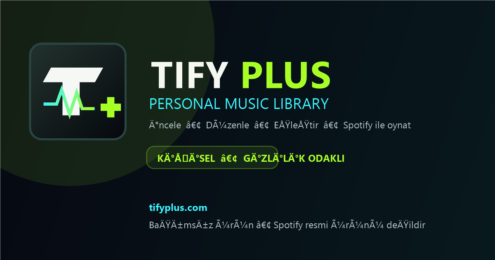

# Tify⁺ Pulse

[](https://tifyplus.com/)
[](LICENSE)
[](https://developer.spotify.com/documentation/web-api)

> Spotify çalma listelerini keşfetmek, analiz etmek, eşleştirmek ve düzenlemek için tarayıcı tabanlı açık kaynak müzik stüdyosu.

**Canlı uygulama:** [https://tifyplus.com/](https://tifyplus.com/)



## Ne işe yarar?

Tify⁺ Pulse, Spotify müzik arşivini tek bir çalışma alanında daha anlaşılır ve yönetilebilir hâle getirir. Çalma listelerini görüntüler, parçaları analiz etmeye yardımcı olur, benzer listeleri eşleştirir ve desteklenen hesaplarda Spotify'ın resmî oynatma altyapısını kullanır.

### Öne çıkan özellikler

- Spotify OAuth 2.0 + PKCE ile güvenli hesap bağlantısı
- Çalma listesi ve parça koleksiyonu görünümü
- Playlist DNA analizi ve akıllı eşleştirme araçları
- Toplu düzenleme ve Spotify'a aktarma akışları
- Spotify Web Playback SDK ile tarayıcı içi oynatma
- Cihaz, ses, ileri/geri sarma ve karışık çalma kontrolleri
- Mobil ve masaüstü uyumlu arayüz
- Düşük parlamalı açık tema ve koyu tema
- Sunucu tarafında Tify⁺ Pulse kullanıcı hesabı oluşturmayan gizlilik odaklı yapı

## Hızlı kullanım

1. [tifyplus.com](https://tifyplus.com/) adresini açın.
2. **Spotify ile giriş** düğmesine basın.
3. Spotify'ın resmî izin ekranındaki erişimleri inceleyip onaylayın.
4. Kütüphaneniz yüklendiğinde bir çalma listesi seçin.
5. Analiz, eşleştirme, düzenleme veya oynatma araçlarını kullanın.

> Tam parça oynatma ve Web Playback SDK özellikleri için Spotify Premium gerekebilir. Desteklenmeyen tarayıcı veya hesaplarda uygulama Spotify'ın resmî gömülü oynatıcısını ya da Spotify uygulamasını kullanabilir.

## Yerel geliştirme

Gereksinimler: güncel Node.js ve npm.

```bash
git clone https://github.com/byspacex/tifyplus.git
cd tifyplus
npm install
npm run dev
```

Yerel adres: `http://127.0.0.1:5173/`

Üretim derlemesi:

```bash
npm run build
```

Çıktılar `dist/` klasörüne yazılır.

## Kendi Spotify uygulamanızla kullanma

1. Spotify Developer Dashboard'da bir uygulama oluşturun.
2. Yönlendirme adreslerine çalıştırdığınız sitenin tam adresini ekleyin. Canlı sürüm için `https://tifyplus.com/` kullanılır; sondaki `/` önemlidir.
3. Yalnızca herkese açık **Client ID** değerini Tify⁺ Pulse içindeki “Kendi Spotify uygulamam” alanına girin.
4. **Client Secret** değerini tarayıcıya, repoya veya kaynak koda eklemeyin.

Uygulama Authorization Code + PKCE akışını kullanır.

## Gizlilik yaklaşımı

- Spotify erişim belirteçleri aktif sekmenin oturum depolamasında tutulur.
- Kişisel Spotify kütüphanesi ve parça önbelleği yalnızca aktif sekmenin oturumunda tutulur; başka hesapların çalışma alanına karışmaz.
- Dil ve tema gibi arayüz tercihleri yalnızca izin verildiğinde tarayıcıda kalıcı olarak saklanır.
- Reklam veya davranış analitiği kullanılmaz.
- Sunucu tarafında Tify⁺ Pulse kullanıcı profili oluşturulmaz.
- Spotify parolanız uygulama tarafından görülmez veya saklanmaz.

## Test ve kalite kontrolü

```bash
npm run test:spotify-player
npm run build
npm audit --omit=dev --audit-level=high
```

Bu kontroller kaynak sözleşmesini, üretim derlemesini ve bilinen yüksek önem düzeyindeki paket açıklarını denetler. Gerçek Spotify sesi için ayrıca Premium hesapla, desteklenen tarayıcıda kullanıcı etkileşimli canlı test gerekir.

## Teknoloji

- Vite ve Vanilla JavaScript
- Spotify Web API
- Spotify Web Playback SDK
- Spotify Embed iFrame API
- Cloudflare Pages

## Katkı

Hata bildirimi veya iyileştirme önerisi için GitHub Issues kullanabilirsiniz. Değişiklik göndermeden önce testleri ve üretim derlemesini çalıştırın; erişim anahtarı, token, Client Secret veya kişisel veri eklemeyin.

## Marka ve lisans

Tify⁺ Pulse bağımsız bir üründür; Spotify tarafından desteklenmez, sponsor edilmez veya Spotify'ın resmî ürünü değildir. Spotify®, Spotify AB'nin tescilli markasıdır.

Kaynak kod [MIT Lisansı](LICENSE) ile yayımlanır.
